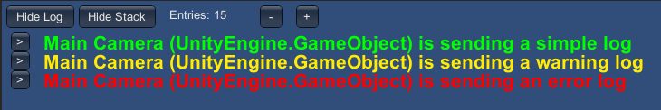
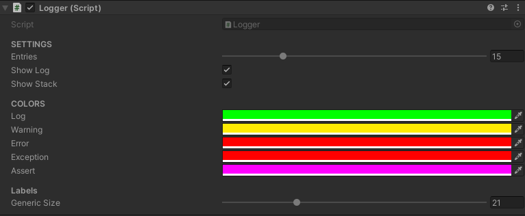

# Build Logger

Adds the possibility to visualize logs during game build testing with various types of customization

### Content

[**Features**](#features) - [**Installation**](#installation) - [**First Setup**](#first-setup) -  [**Screen Shots**](#screen-shots)

---

### Features

- Toggle ON/OFF when not needed.
- Custom colors based on the type of log received.
- Adjustable font size.
- Stack trace available.

---

### Installation

1. From the main branch click the **`[Code]`** button and copy the HTTPS link.
2. In Unity, open the package manager and click the **`[+]`** icon on the top left screen.
3. Select **`[Add package from git URL]`** and paste the link copied in step 1.

---

### First Setup

In order to start using the logger you will need to create a new **`[GameObject]`** in the scene and add a component **`[Logger]`**. In order to visualize **`[Stack Trace]`** during a build playtest be sure to check **`[Development Build]`** in the **`[Build Settings]`** window.

---

### Screen Shots

